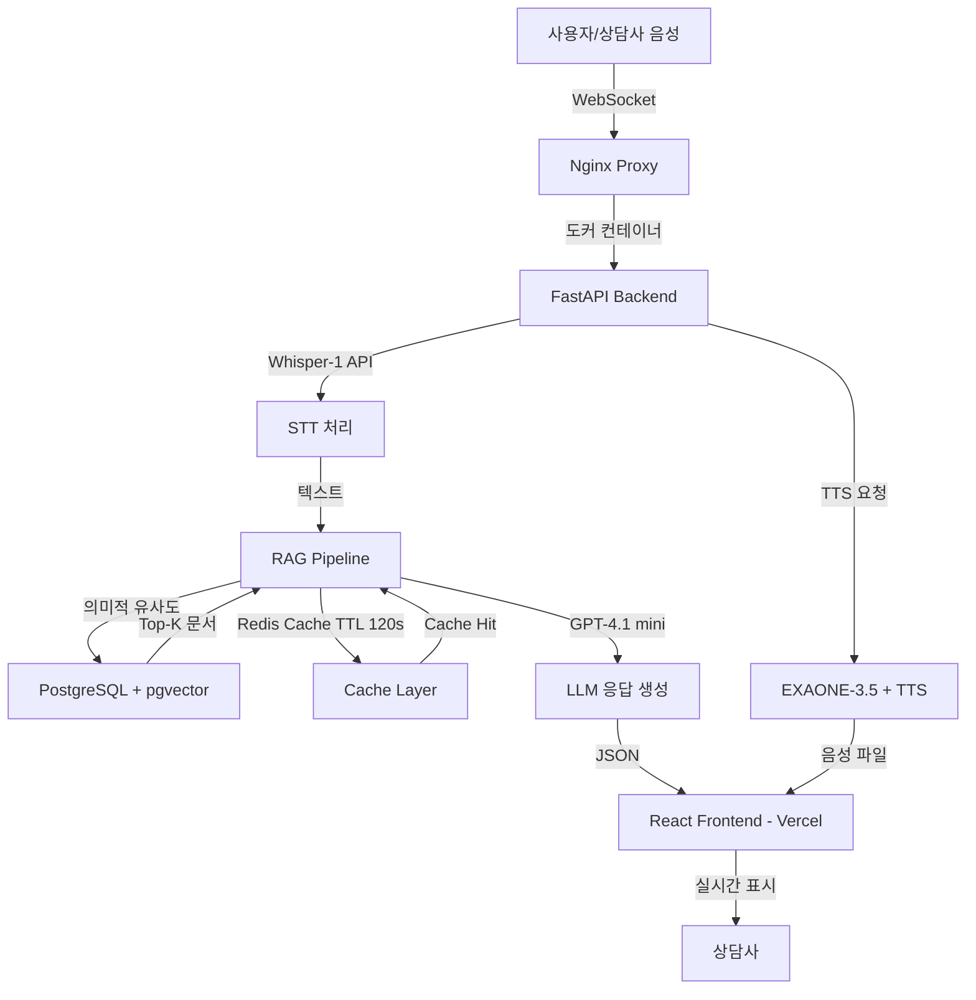

# CALL:ACT

<!-- 권장 사이즈: 400x100px, 배경 투명 PNG -->


> **카드사 상담사를 위한 AI 기반 실시간 상담 지원 시스템**
> Speech-to-Text, RAG, LLM을 활용하여 정확하고 빠른 상담을 지원합니다.


**프로젝트 기간**: 2025.12.18 ~ 진행 중 (2026.02.11 최종 마감)
**팀**: READYTEDDY

[데모 보기](#demo) | [시작하기](#getting-started) | [주요 기능](#features) | [아키텍처](#architecture) | [팀 소개](#team)

---

## 목차
- [Demo](#demo)
- [About The Project](#about-the-project)
- [Features](#features)
- [Built With](#built-with)
- [Getting Started](#getting-started)
- [Usage](#usage)
- [Architecture](#architecture) *(Database Schema, Performance 포함)*
- [Technical Deep Dive](#technical-deep-dive)
- [Data Processing](#data-processing)
- [Troubleshooting](#troubleshooting)
- [Roadmap](#roadmap)
- [Contributing](#contributing)
- [Team](#team)
- [License](#license)
- [Contact](#contact)
- [Acknowledgments](#acknowledgments)

---

## Demo

### Live Demo

| 환경 | URL | 상태 |
|------|-----|------|
| **Figma 프로토타입** | [callact.figma.site](https://callact.figma.site) | ✅ 접속 가능 |
| **Production** | 배포 예정 | 🔜 준비 중 |

### 📹 데모 영상

| 영상 | 설명 | 링크 |
|------|------|------|
| 전체 데모 | 대시보드 → 실시간 상담 → 후처리 | [YouTube](https://youtu.be/V53akHQd8jU) |
| 실시간 상담 (RAG) | STT 키워드 추출 및 RAG 문서 검색 | [YouTube](https://youtu.be/pjBJqcaVj2Y) |

### 스크린샷

#### 실시간 상담 화면

<!-- 권장 사이즈: 1200x800px, PNG 형식 -->
<!-- 포함 요소: 좌측 대기 콜 목록, 중앙 상담 대화(STT), 우측 RAG 검색 결과, 하단 키워드 태그 -->


#### 대시보드

<!-- 권장 사이즈: 1200x800px, PNG 형식 -->
<!-- 포함 요소: 오늘 통화 통계, 팀별 성과 차트, 우수 상담사 랭킹, 최근 상담 내역 -->


#### 후처리 (ACW) 화면

<!-- 권장 사이즈: 1200x800px, PNG 형식 -->
<!-- 포함 요소: AI 자동 요약 결과, 상담 유형 자동 분류, 메모 입력, 인계 처리 -->


---

## About The Project

### 문제 정의

카드사 상담사는 다음과 같은 복잡한 업무 환경에서 근무합니다:

- **정보 과부하**: 수십 종의 카드 상품, 약관, 혜택 정보를 실시간으로 파악해야 함
- **긴 교육 기간**: 입사 후 30일 이상 교육, 단독 상담까지 추가로 30일 이상 소요 (조사 결과)
- **다중 시스템 참조**: 상담 중 여러 문서 검색 시스템, 약관, FAQ를 동시에 참조해야 하는 부담
- **높은 정확성 요구**: 금융 규제 및 준법 준수 요구로 오답 시 법적 리스크 발생
- **후처리 부담**: 상담 종료 후 요약, 분류, 기록 업무로 평균 처리 시간(AHT/ACW) 증가

### 해결 방법

**CALL:ACT**는 다음 기술로 상담사의 업무 부담을 경감합니다:

| 기술 | 설명 | 성능 목표 |
|------|------|----------|
| **실시간 STT** | Faster-Whisper 기반 음성-텍스트 변환 | WER < 0.1, RTF ≤ 0.5 |
| **RAG 검색** | pgvector 기반 의미적 유사도 검색 | Recall@3 ≥ 90%, 응답 3초 이내 |
| **AI 요약** | GPT-4.1 mini 기반 상담 자동 요약 및 후처리 | ROUGE-L ≥ 0.45, F1 ≥ 0.9 |
| **교육 시뮬레이션** | 시나리오 기반 훈련 및 피드백 | 6개 시나리오 (초급~고급) |

### 주요 특징

- **실시간 키워드 추출 및 문서 검색**: 상담 중 자동으로 관련 문서, 약관, FAQ 표시
- **실제 데이터 기반 학습**: 13개 데이터 소스, 7,326건 전처리 완료 (하나, 삼성, 신한, 현대, 특수카드 등)
- **Multi-Model Strategy**: Main LLM + Domain SLM + Persona SLM 조합으로 비용 최적화 및 정확도 향상
- **83% 성능 개선**: 4단계 최적화로 응답 시간 15.68s → 2.60s 단축
- **후처리 자동화**: 상담 요약, 분류, 피드백 자동 생성 (Faithfulness 0.94)
- **교육 시뮬레이션**: 시나리오 기반 훈련 시스템으로 신입 상담사 교육 기간 단축
- **통합 대시보드**: 실시간 통화 통계, 팀별 성과, 우수 상담사 랭킹 한눈에 확인

---

## Features

CALL:ACT는 9개 모듈, 37개 기능 요구사항으로 구성되어 있습니다.

**완성도 범례**: ✅ 완료 | 🔄 진행 중 | 🔜 예정

<!-- TODO: 아래 각 기능의 완성도 상태를 확인하여 ✅, 🔄, 🔜 중 하나로 표시해주세요 -->

### 1. 실시간 상담 지원 (CSU - Customer Service Unit)

| 상태 | 기능 |
|:----:|------|
| ✅ | STT 기반 실시간 키워드 추출 및 색상별 카테고리 표시 |
| ✅ | RAG 검색으로 관련 문서, 약관, FAQ 자동 표시 |
| 🔄 | 대기 콜 현황 및 우선순위 관리 |
| 🔜 | 고객 히스토리 조회 (이전 상담 기록) - **고객 DB 연동 필요** |
| ✅ | 상담 가이드 제공 (스크립트, 예외 사항) |
| ✅ | 통화 시간 실시간 표시 |

### 2. 후처리 자동화 (ACW - After Call Work)

| 상태 | 기능 |
|:----:|------|
| 🔄 | **AI 기반 상담 자동 요약** (GPT-4.1 mini, Faithfulness 0.94) |
| 🔄 | **자동 분류** (상담 유형, Macro F1-Score 0.9) |
| ✅ | 메모 입력 및 편집 |
| 🔜 | 인계 처리 및 저장 |
| 🔜 | 유사 상담 사례 자동 추천 - **상담 내역 DB 연동 필요** |
| 🔄 | 상담 전문 (Transcript) 조회 |

### 3. 분석 및 피드백 (ANL - Analysis & Feedback)

| 상태 | 기능 |
|:----:|------|
| 🔜 | 고객 감정 변화 분석 (시간대별) - **감정 분석 모델 연동 필요** |
| 🔄 | 상담사 피드백 오각형 그래프 (응답 속도, 정확성, 친절도, 문제 해결, 전문성) |

### 4. 교육 시뮬레이션 (EDU - Education)

| 상태 | 기능 |
|:----:|------|
| 🔜 | 시뮬레이션 분류 선택 (6개 시나리오: 초급~고급) |
| 🔜 | 시나리오 기반 상담 진행 - **TTS 연동 필요** |
| 🔜 | 점수 기반 평가 및 피드백 |
| 🔜 | 후처리 연습 및 개선 제안 |

### 5. 대시보드 (DASH - Dashboard)

| 상태 | 기능 |
|:----:|------|
| ✅ | 실시간 통화 통계 (오늘 통화, 완료율, FCR 달성도) |
| ✅ | 팀별 성과 시각화 (Recharts 차트) |
| ✅ | 우수 상담사 랭킹 (Top 3) |
| 🔄 | 최근 상담 내역 리스트 및 상세보기 - **상담 내역 DB 연동 필요** |
| ✅ | 공지사항 (핀 고정 기능) |
| ✅ | 금주의 이슈 (Hot Issue) |
| 🔄 | 우수 사례 공유 |

### 6. 워크플로우 (WORK - Work Flow)

| 상태 | 기능 |
|:----:|------|
| ✅ | 상담 시작 (대기 콜 선택 → 실시간 상담) |
| 🔜 | 교육 시뮬레이션 시작 (시나리오 선택 → 진행 → 평가) |

### 7. 프로필 (PROF - Profile)

| 상태 | 기능 |
|:----:|------|
| ✅ | 프로필 조회 (사진, 이름, 부서, 직급, 통계) |
| ✅ | 개인정보 수정 (비밀번호 변경 등) |

### 8. 관리 기능 (ADM - Admin)

| 상태 | 기능 |
|:----:|------|
| ✅ | 직원 관리 (추가, 수정, 삭제) |
| ✅ | 권한 그룹 표시 및 변경 |
| ✅ | 계정 활성화/비활성화 |
| ✅ | 공지사항 및 이슈 관리 (작성, 수정, 삭제) |
| 🔄 | 통계 조회 (전체 상담 기록, 성과 분석) |

### 9. 회원 관리 (MBM - Member Management)

| 상태 | 기능 |
|:----:|------|
| ✅ | 로그인 유효성 검사 |
| ✅ | 권한 관리 (Admin, Manager, Employee) |

### 기능 완성도 요약

<!-- TODO: 아래 수치를 실제 완성도에 맞게 업데이트해주세요 -->

| 모듈 | 완료 | 진행 중 | 예정 | 완성도 |
|------|:----:|:------:|:----:|:------:|
| CSU (실시간 상담) | 4 | 1 | 1 | 67% |
| ACW (후처리) | 1 | 3 | 2 | 17% |
| ANL (분석/피드백) | 0 | 1 | 1 | 0% |
| EDU (교육) | 0 | 0 | 4 | 0% |
| DASH (대시보드) | 5 | 2 | 0 | 71% |
| WORK (워크플로우) | 1 | 0 | 1 | 50% |
| PROF (프로필) | 2 | 0 | 0 | 100% |
| ADM (관리) | 4 | 1 | 0 | 80% |
| MBM (회원) | 2 | 0 | 0 | 100% |
| **전체** | **19** | **8** | **9** | **53%** |

---

## Built With

### Frontend
- [React 18.3.1](https://react.dev/) - UI 라이브러리
- [TypeScript](https://www.typescriptlang.org/) - 정적 타입 시스템
- [Vite 6.3.5](https://vitejs.dev/) - 빌드 도구
- [Tailwind CSS 4.1.12](https://tailwindcss.com/) - Utility-first CSS 프레임워크
- [Radix UI](https://www.radix-ui.com/) - 접근성 높은 UI 컴포넌트 라이브러리
- [Recharts 2.15.2](https://recharts.org/) - React 차트 라이브러리

### Backend
- [FastAPI 0.128.0](https://fastapi.tiangolo.com/) - 고속 Python 웹 프레임워크
- [Python 3.11+](https://www.python.org/) - 프로그래밍 언어
- [PostgreSQL 16](https://www.postgresql.org/) - 관계형 데이터베이스
- [pgvector 0.4.2](https://github.com/pgvector/pgvector) - 벡터 검색 확장
- [Nginx](https://www.nginx.com/) - 프록시 서버 및 로드 밸런서
- [Redis 5.0.4](https://redis.io/) - 캐싱 및 세션 관리 (TTL 120s)
- [Faster-Whisper 1.2.1](https://github.com/SYSTRAN/faster-whisper) - 고속 음성인식

### AI/ML

**Multi-Model Strategy (비용 최적화 및 응답 속도 개선)**:

| 구분 | 모델명 | 주요 역할 | 선정 사유 |
|------|--------|----------|----------|
| **Main LLM** | [OpenAI GPT-4.1 mini](https://openai.com/) | 전체 맥락 요약 및 후처리 | 복잡한 추론 및 대화 흐름 파악 시 높은 정확도 |
| **Domain SLM** | Llama-3-Kor-BCCard-8B | 금융 도메인 지식 추출 | BC카드 특화 데이터 기반 금융 약관 이해도 우수 |
| **Persona SLM** | EXAONE-3.5-2.4B | 상담원 교육 대화 페르소나 | 한국어 뉘앙스 및 격식체 구현 |
| **Embedding** | OpenAI text-embedding-3-small | RAG 벡터 검색 (1536차원) | 다국어 처리 강점 및 낮은 인프라 비용 |
| **TTS** | OpenAI gpt-4o-mini-tts | 텍스트 → 음성 변환 | 자연스러운 음성 합성 |

**추가 프레임워크**:
- [LangChain 1.2.2](https://www.langchain.com/) - LLM 애플리케이션 프레임워크
- [LLaMA Index 0.14.12](https://www.llamaindex.ai/) - 문서 인덱싱 및 RAG

---

## Getting Started

### Prerequisites

다음 소프트웨어가 설치되어 있어야 합니다:

```bash
# Python 3.11 이상
python --version

# Node.js 18 이상
node --version

# PostgreSQL 16 이상
psql --version
```

### Installation

#### 1. 저장소 클론 및 서브모듈 초기화

```bash
git clone https://github.com/SKNETWORKS-FAMILY-AICAMP/SKN19-FINAL-1Team.git
cd call-act

# 서브모듈 초기화 (backend, frontend, data-preprocessing)
git submodule update --init --recursive
```

#### 2. 환경 변수 설정

```bash
# Backend 환경 변수
cp backend/.env.example backend/.env
# .env 파일 편집: OPENAI_API_KEY, DB 정보 등 설정
```

**필수 환경 변수**:
- `OPENAI_API_KEY`: OpenAI API 키
- `DB_HOST`, `DB_PORT`, `DB_NAME`, `DB_USER`, `DB_PASSWORD`: PostgreSQL 정보

#### 3. 데이터베이스 설정

<details>
<summary><strong>Linux / macOS</strong></summary>

```bash
# PostgreSQL 데이터베이스 생성
createdb callact

# pgvector 확장 설치
psql callact -c "CREATE EXTENSION vector;"

# 스키마 생성 (23개 테이블, 16개 Enum)
cd backend/app/db/scripts
psql callact < 01_setup_callact_db.sql
```

</details>

<details>
<summary><strong>Windows (PowerShell)</strong></summary>

```powershell
# 1. PostgreSQL bin 디렉토리를 PATH에 추가 (일반적으로 C:\Program Files\PostgreSQL\16\bin)
# 또는 pgAdmin 사용 권장

# 2. PostgreSQL 데이터베이스 생성
createdb -U postgres callact

# 3. pgvector 확장 설치 (관리자 권한 필요)
psql -U postgres -d callact -c "CREATE EXTENSION vector;"

# 4. 스키마 생성
cd backend\app\db\scripts
psql -U postgres -d callact -f 01_setup_callact_db.sql
```

**pgAdmin 사용 시**:
1. pgAdmin 실행 → Servers → PostgreSQL 연결
2. Databases 우클릭 → Create → Database → Name: `callact`
3. Query Tool 열기 → `CREATE EXTENSION vector;` 실행
4. `01_setup_callact_db.sql` 파일 내용 복사하여 실행

</details>

#### 4. Backend 실행

```bash
cd backend
pip install -r requirements.txt
uvicorn app.main:app --reload --port 8000
```

#### 5. Frontend 실행

```bash
cd frontend
npm install
npm run dev
```

#### 6. 브라우저에서 확인

```
http://localhost:5173
```

**Swagger API 문서**: `http://localhost:8000/docs`

---

## Usage

### 1. 실시간 상담

1. 로그인 후 **"실시간 상담"** 메뉴 선택
2. 대기 콜 목록에서 상담 선택 (우선순위별 표시)
3. **실시간 STT**로 키워드 자동 추출 (색상별 카테고리 구분)
4. **RAG 검색** 결과를 참고하여 고객 응대
   - 관련 문서, 약관, FAQ 자동 표시
   - 유사 상담 사례 제공
5. 상담 완료 후 **"후처리"** 버튼 클릭

### 2. 후처리 (ACW)

1. **AI 자동 요약** 결과 확인
2. 필요 시 메모 추가
3. 상담 유형 자동 분류 확인
4. 인계 처리 및 저장

### 3. 교육 시뮬레이션

1. **"교육"** 메뉴에서 시나리오 선택 (6개: 초급~고급)
2. 시나리오에 따라 상담 진행
3. **점수 기반 피드백** 확인
   - 응답 속도, 정확성, 고객 만족도 평가
4. 재시도 및 개선

### 4. 대시보드

- 오늘 통화 건수, 완료율, FCR 달성도 실시간 확인
- 팀별 성과 차트 (Recharts)
- 우수 상담사 랭킹 (Top 3)
- 최근 상담 내역 테이블

---

## Architecture

### 시스템 아키텍처


<details>
<summary><strong>📊 Mermaid 다이어그램 (텍스트 버전)</strong></summary>



</details>

**핵심 서비스 모듈**:

| 모듈 | 기술 스택 | 역할 |
|------|----------|------|
| **STT** | OpenAI Whisper-1 | 음성 → 텍스트 변환 (WER < 0.26) |
| **RAG** | pgvector + GPT-4.1 mini | 의미적 검색 및 답변 생성 |
| **TTS** | EXAONE-3.5-2.4B + gpt-4o-mini-tts | 답변 생성 및 음성 변환 |
| **Cache** | Redis (TTL 120s, Fail-open) | 응답 속도 최적화 (1초대) |
| **Proxy** | Nginx | 요청 분산 및 컨테이너 관리 |

### RAG 파이프라인 (5단계)

| 단계 | 프로세스 | 주요 기술 및 수행 내용 |
|------|---------|----------------------|
| **1. 입력** | Input & STT | • 음성 → 텍스트 변환 (Whisper-1)<br>• 도메인 어휘 사전 기반 키워드 추출 (FlashText) |
| **2. 분석** | Routing | • Intent 분석 (카드명, 혜택, 결제수단 Entity 파악)<br>• 쿼리 최적화 (상품 정보 vs 이용 규정 DB 라우팅) |
| **3. 검색** | Hybrid Retrieval | • Vector 검색 (pgvector, 코사인 유사도)<br>• Keyword 검색 (PostgreSQL ILIKE)<br>• RRF 랭킹 (Reciprocal Rank Fusion) |
| **4. 생성** | Cache-First Layer | • Redis 캐시 우선 조회 (TTL 120s, Hit 시 1초대)<br>• Cache Miss 시 GPT-4.1 mini 요약 생성 (top_n=2, 450자 제한) |
| **5. 정제** | Post-processing | • JSON 정합성 검증<br>• 문단 분리 및 키워드 해시태그화 (#) |

**데이터 처리 흐름**:

```
원본 데이터 (CSV, PDF, HTML)
    ↓
1. 크롤링 (Selenium, BeautifulSoup)
    ↓
2. 파싱 (LLaMA Parser, pdfplumber)
    ↓
3. 1차 전처리 (팀원별 JSON 구조 통일)
    ↓
4. 2차 전처리 (화면단 구조 변형, 메타데이터 보강)
    ↓
5. 임베딩 (OpenAI text-embedding-3-small, 1536차원)
    ↓
6. DB 적재 (PostgreSQL + pgvector)
    ↓
7. RAG 검색 (Hybrid Retrieval + RRF)
    ↓
8. LLM 생성 (GPT-4.1 mini, 프롬프트 최적화)
    ↓
9. Frontend 표시 (React, 실시간 WebSocket)
```

### 디렉토리 구조

```
call-act/
├── backend/              (FastAPI 서버)
│   ├── app/
│   │   ├── api/          (API 엔드포인트)
│   │   ├── audio/        (STT 처리)
│   │   ├── crud/         (DB CRUD 작업)
│   │   ├── db/           (DB 연결 및 스키마)
│   │   ├── llm/          (LLM 통합)
│   │   ├── rag/          (RAG 파이프라인)
│   │   └── schemas/      (데이터 스키마)
│   └── requirements.txt
├── frontend/             (React UI)
│   ├── src/
│   │   ├── app/
│   │   │   ├── components/ (UI 컴포넌트)
│   │   │   ├── pages/      (페이지)
│   │   │   └── contexts/   (상태 관리)
│   │   └── data/         (Mock 데이터)
│   └── package.json
├── data-preprocessing/   (데이터 파이프라인)
│   ├── crawling/         (웹 크롤링)
│   ├── parsing/          (PDF/HTML 파싱)
│   ├── preprocess/       (데이터 정제)
│   └── data/             (전처리 완료 데이터)
└── docs/                 (프로젝트 문서 및 최종산출물)
    ├── images/
```

### Database Schema

- **총 23개 테이블, 16개 Enum**
- **3개 논리적 데이터베이스**:
  1. **카드 정보 DB** (6 테이블): 카드 상품, 혜택, 수수료, 포인트, 프로모션
  2. **카드사 이용안내 DB** (4 테이블): 공지사항, FAQ, 가이드 문서 + 벡터 임베딩
  3. **상담 사례 DB** (13 테이블): 직원, 상담, 전문, 요약, 피드백, STT 키워드, 교육 시나리오, 우수 사례 + 벡터 임베딩

**주요 테이블**:

| 테이블명 | 설명 | 주요 컬럼 |
|---------|------|----------|
| `card_products` | 카드 상품 정보 | card_id, card_name, card_type, issuer |
| `card_benefits` | 카드 혜택 | benefit_id, card_id, category, discount_rate |
| `service_guide_documents` | 이용안내 문서 + 임베딩 | doc_id, title, content, **embedding** (vector 1536) |
| `consultations` | 상담 마스터 | consultation_id, employee_id, customer_id, status, fcr_achieved |
| `consultation_transcripts` | 상담 전문 (STT) | transcript_id, consultation_id, speaker, text, timestamp |
| `consultation_documents` | 상담 문서 + 임베딩 | doc_id, consultation_id, content, **embedding** (vector 1536) |
| `training_scenarios` | 교육 시나리오 | scenario_id, title, difficulty, description |
| `best_practices` | 우수 상담 사례 | practice_id, consultation_id, tags, upvotes |

**벡터 검색**: `embedding` 컬럼(vector 1536)을 pgvector로 유사도 검색하여 RAG 구현

_자세한 ERD 및 스키마는 [데이터베이스 설계 문서](docs/05_데이터베이스%20설계%20문서.pdf)를 참고하세요._

### Performance & Optimization

#### RAG 성능 최적화 (83% 개선)

4단계에 걸쳐 응답 시간을 **15.68초 → 2.60초**로 단축했습니다.

| 최적화 단계 | 주요 조치 내용 | 응답 시간 | 개선율 |
|------------|---------------|----------|-------|
| **Step 1. 초기 모델** | RAG 기본 파이프라인 구성 및 전체 필드 생성 | **15.68s** | - |
| **Step 2. 프롬프트 경량화** | JSON Schema 간소화, `content` 생성 집중 | **11.71s** | 25% ↓ |
| **Step 3. 파라미터 튜닝** | `top_k` 최적화 (4→2), 문서 길이 제한 (450자) | **7.81s** | 33% ↓ |
| **Step 4. 캐시/구조 최적화** | Redis TTL 120s 캐시, Fail-open 구조 | **2.60s** | **83% ↓** |

**주요 최적화 기법**:
- **Hallucination 제어**: `temperature=0.0`으로 응답 일관성 확보
- **Latency 최적화**: `llm_card_top_n=2`, `MAX_CARD_DOC_CHARS=450`으로 입력 토큰 축소
- **Cache 전략**: Redis TTL 120초, Cache Hit 시 1초대 응답
- **Fail-open 설계**: Redis 장애 시 DB 직접 조회로 자동 Fallback

#### 성능 측정 결과

**RAG 성능**:

| 지표 | 결과 | 목표치 | 달성 여부 |
|------|------|--------|----------|
| **Recall@3** | 0.9 | ≥ 0.9 | ✅ |
| **Macro F1-Score** | 0.9 | ≥ 0.9 | ✅ |
| **RAGAS Faithfulness** | 0.94 | ≥ 0.9 | ✅ |
| **RLHF 평균 점수** | 4.0 / 5.0 | ≥ 4.0 | ✅ |
| **평균 응답 시간** | 2.6초 | ≤ 3초 | ✅ |
| **Cache Hit 응답** | 1초대 | ≤ 2초 | ✅ |
| **ROUGE-L** | 0.17 | - | 핵심 키워드 중심 설계 |

_※ ROUGE-L이 낮은 이유: 상담 특성상 불필요한 수식어를 배제하고 핵심 Entity 위주로 답변하도록 의도적으로 튜닝_

**STT 성능**:

| 지표 | 결과 | 목표치 | 달성 여부 |
|------|------|--------|----------|
| **WER (단어 오류율)** | 0.26 | ≤ 0.3 | ✅ |
| **CER (음절 오류율)** | 0.12 | ≤ 0.15 | ✅ |
| **평균 변환 시간** | 1.23초 | - | - |
| **p95 변환 시간** | 2.36초 | ≤ 3초 | ✅ |
| **RTF (Real-Time Factor)** | 0.40 | ≤ 0.5 | ✅ |

_※ RTF 0.40 = 10초 음성을 약 4초만에 처리_

**테스트 환경**: macOS / Python 3.11 / PostgreSQL 16 + pgvector / Redis / OpenAI GPT-4.1-mini / 12개 질의 테스트 셋

_자세한 테스트 결과는 [테스트 계획 및 결과 보고서](docs/11_테스트%20계획%20및%20결과%20보고서.pdf)를 참고하세요._

---

## Technical Deep Dive

이 섹션에서는 CALL:ACT의 핵심 기술 구현을 상세히 설명합니다.

### 1. 도메인 어휘사전 기반 키워드 추출 (FlashText)

**문제**: 실시간 상담에서 카드명, 금융 활동, 결제수단 등의 핵심 키워드를 빠르게 추출해야 함. 정규표현식은 O(n×m) 시간복잡도로 느리고, 동의어 처리가 어려움.

**해결**: FlashText 알고리즘을 활용한 O(n) 시간복잡도 키워드 추출

**구현** (`backend/app/rag/router.py`):

```python
from flashtext import KeywordProcessor

def _build_processor(synonyms: Dict[str, List[str]]) -> KeywordProcessor:
    """동의어 사전을 FlashText 프로세서로 변환 (O(1) 검색)"""
    kp = KeywordProcessor(case_sensitive=False)
    for canonical, terms in synonyms.items():
        # 정규화된 용어 추가
        kp.add_keyword(canonical, canonical)
        # 모든 동의어를 정규화된 용어로 매핑
        for term in terms:
            kp.add_keyword(term, canonical)
    return kp

# 4개 도메인별 프로세서 초기화
_CARD_KP = _build_processor(CARD_NAME_SYNONYMS)      # 카드명 (512개)
_ACTION_KP = _build_processor(ACTION_SYNONYMS)        # 금융 활동 (67개)
_PAYMENT_KP = _build_processor(PAYMENT_SYNONYMS)      # 결제수단 (23개)
_WEAK_INTENT_KP = _build_processor(WEAK_INTENT_SYNONYMS)  # 약한 의도 (18개)
```

**동의어 예시**:
```python
CARD_NAME_SYNONYMS = {
    "나라사랑카드": ["나라사랑", "나라사랑 카드", "군인카드"],
    "국민행복카드": ["국민행복", "국민 행복", "행복카드"],
    # ... 512개 카드명
}

ACTION_SYNONYMS = {
    "분실": ["잃어버렸어요", "도난당했어요", "없어졌어요"],
    "재발급": ["다시 발급", "재신청", "새로 받고 싶어요"],
    # ... 67개 액션
}
```

**성능**:
- **시간복잡도**: O(n) (텍스트 길이에만 비례)
- **동의어 매칭**: "나라사랑" → "나라사랑카드" 자동 정규화
- **대소문자 무관**: `case_sensitive=False`

---

### 2. 시맨틱 라우터 (Semantic Router)

**문제**: 사용자 의도에 따라 적절한 검색 범위를 결정해야 함. "카드 혜택"과 "카드 분실 신고"는 다른 DB 테이블을 검색해야 함.

**해결**: 7가지 분기 로직으로 키워드 조합 패턴을 분석하여 최적 검색 경로 결정

**구현** (`backend/app/rag/router.py`):

<details>
<summary><strong>📖 7-Branch 라우팅 코드 보기 (클릭하여 펼치기)</strong></summary>

```python
def route_query(query: str) -> Dict[str, Optional[object]]:
    """
    7-branch 라우팅 로직: 키워드 조합 → 검색 경로 결정

    Returns:
        {
            "ui_route": "card_info" | "card_usage",  # UI 표시 영역
            "db_route": "card_tbl" | "guide_tbl" | "both",  # 검색 테이블
            "boost": {...},  # 메타데이터 필터
            "query_template": "...",  # 최적화된 쿼리
            "should_trigger": bool  # RAG 실행 여부
        }
    """
    # 정규화 (공백, 특수문자 제거)
    normalized = _normalize_query(query)

    # FlashText로 키워드 추출
    card_names = _unique_in_order(_CARD_KP.extract_keywords(normalized))
    actions = _unique_in_order(_ACTION_KP.extract_keywords(normalized))
    payments = _unique_in_order(_PAYMENT_KP.extract_keywords(normalized))
    weak_intents = _unique_in_order(_WEAK_INTENT_KP.extract_keywords(normalized))

    # ━━━━━━━━━━━━━━━━━━━━━━━━━━━━━━━━━━━━━━━━━━━━━━━━━
    # 7-Branch Routing Logic
    # ━━━━━━━━━━━━━━━━━━━━━━━━━━━━━━━━━━━━━━━━━━━━━━━━━

    # Branch 1: 카드명 + 액션 (가장 강한 시그널)
    if card_names and actions:
        ui_route = ROUTE_CARD_USAGE
        db_route = "both"  # 카드 테이블 + 가이드 테이블 모두 검색
        boost = {"card_name": card_names, "intent": actions}
        if payments:
            boost["payment_method"] = payments
        if weak_intents:
            boost["weak_intent"] = weak_intents
        query_template = f"{card_names[0]} {actions[0]} 방법"
        should_trigger = True

    # Branch 2: 카드명 + 결제수단
    elif card_names and payments:
        ui_route = ROUTE_CARD_USAGE
        db_route = "card_tbl"  # 카드 테이블만 검색
        boost = {"card_name": card_names, "payment_method": payments}
        query_template = f"{card_names[0]} {payments[0]} 사용 방법"
        should_trigger = True

    # Branch 3: 카드명 + 약한 의도
    elif card_names and weak_intents:
        # "혜택", "포인트" 등 약한 의도는 ROUTE 힌트로 변환
        ui_route = WEAK_INTENT_ROUTE_HINTS.get(weak_intents[0], ROUTE_CARD_USAGE)
        db_route = "both"
        boost = {"card_name": card_names, "weak_intent": weak_intents}
        if ui_route == ROUTE_CARD_INFO:
            query_template = f"{card_names[0]} {weak_intents[0]}"
        else:
            query_template = f"{card_names[0]} {weak_intents[0]} 방법"
        should_trigger = True

    # Branch 4: 카드명만
    elif card_names:
        ui_route = ROUTE_CARD_INFO
        db_route = "card_tbl"
        boost = {"card_name": card_names}
        query_template = f"{card_names[0]} 정보"
        should_trigger = True

    # Branch 5: 액션만 (화이트리스트 체크)
    elif actions:
        ui_route = ROUTE_CARD_USAGE
        db_route = "guide_tbl"  # 가이드 테이블만 검색
        boost = {"intent": actions}
        if payments:
            boost["payment_method"] = payments
        query_template = f"카드 {actions[0]} 방법"
        # 허용된 액션만 RAG 트리거 (분실, 재발급 등)
        should_trigger = any(a in ACTION_ALLOWLIST for a in actions)

    # Branch 6: 결제수단만 (화이트리스트 체크)
    elif payments:
        ui_route = ROUTE_CARD_USAGE
        db_route = "card_tbl"
        boost = {"payment_method": payments}
        query_template = f"{payments[0]} 사용 방법"
        should_trigger = any(p in PAYMENT_ALLOWLIST for p in payments)

    # Branch 7: 폴백 (키워드 없음)
    else:
        ui_route = ROUTE_CARD_USAGE
        db_route = "both"
        boost = {}
        query_template = None  # 원본 쿼리 사용
        should_trigger = False  # RAG 실행 안 함 (비용 절약)

    return {
        "ui_route": ui_route,
        "db_route": db_route,
        "boost": boost,
        "query_template": query_template or query,
        "should_trigger": should_trigger,
    }
```

</details>

**라우팅 예시**:

| 입력 쿼리 | 추출 키워드 | Branch | db_route | query_template |
|----------|------------|--------|----------|----------------|
| "나라사랑카드 분실 신고 어떻게 해요?" | card=나라사랑카드, action=분실 | 1 | both | "나라사랑카드 분실 방법" |
| "나라사랑카드 온라인 결제 되나요?" | card=나라사랑카드, payment=온라인 | 2 | card_tbl | "나라사랑카드 온라인 사용 방법" |
| "나라사랑카드 혜택 알려주세요" | card=나라사랑카드, weak=혜택 | 3 | both | "나라사랑카드 혜택" |
| "나라사랑카드" | card=나라사랑카드 | 4 | card_tbl | "나라사랑카드 정보" |
| "카드 분실 신고 방법" | action=분실 | 5 | guide_tbl | "카드 분실 방법" |
| "온라인 결제 안되요" | payment=온라인 | 6 | card_tbl | "온라인 사용 방법" |
| "안녕하세요?" | (없음) | 7 | both | (원본 쿼리) |

**효과**:
- **검색 범위 축소**: 불필요한 테이블 검색 제거 → 응답 속도 향상
- **메타데이터 필터**: `boost` 객체로 정확도 개선 (Recall@3: 0.9)
- **비용 절약**: `should_trigger=False`로 의미 없는 RAG 실행 차단

---

### 3. 하이브리드 검색 (Vector + Keyword + RRF)

**문제**: 벡터 검색만 사용하면 정확한 용어 매칭이 약하고, 키워드 검색만 사용하면 의미적 유사도를 놓칠 수 있음.

**해결**: 벡터 검색 + 키워드 검색을 RRF(Reciprocal Rank Fusion) 알고리즘으로 결합

**구현** (`backend/app/rag/retriever.py`):

#### 3.1 Vector Search (pgvector)

<details>
<summary><strong>📖 Vector Search 코드 보기 (클릭하여 펼치기)</strong></summary>

```python
def vector_search(
    query: str,
    table: str,
    limit: int,
    filters: Optional[Dict[str, object]] = None,
) -> List[Tuple[object, str, Dict[str, object], float]]:
    """
    pgvector 기반 의미적 유사도 검색

    Args:
        query: 사용자 쿼리
        table: 검색 테이블 (service_guide_documents 또는 consultation_documents)
        limit: 반환할 최대 문서 수
        filters: 메타데이터 필터 (card_name, intent 등)

    Returns:
        [(doc_id, content, metadata, score), ...]
    """
    table = _safe_table(table)

    # OpenAI Embedding API 호출 (1536차원)
    emb = Vector(embed_query(query))

    # WHERE 절 생성 (메타데이터 필터)
    where_sql, where_params = build_where_clause(filters, table)

    with _db_conn() as conn:
        register_vector(conn)  # pgvector 타입 등록
        with conn.cursor() as cur:
            # 코사인 거리 연산자 (<=>)
            sql = (
                f"SELECT id, content, metadata, 1 - (embedding <=> %s) AS score "
                f"FROM {table}{where_sql} "
                f"ORDER BY embedding <=> %s LIMIT %s"
            )
            params = [emb, *where_params, emb, limit]

            try:
                cur.execute(sql, params)
            except Exception:
                # 코사인 거리 실패 시 유클리드 거리(<->) 폴백
                conn.rollback()
                sql = (
                    f"SELECT id, content, metadata, 1 - (embedding <-> %s) AS score "
                    f"FROM {table}{where_sql} "
                    f"ORDER BY embedding <-> %s LIMIT %s"
                )
                cur.execute(sql, params)

            return cur.fetchall()
```

</details>

#### 3.2 Keyword Search (PostgreSQL ILIKE)

<details>
<summary><strong>📖 Keyword Search 코드 보기 (클릭하여 펼치기)</strong></summary>

```python
def keyword_search(
    query: str,
    table: str,
    limit: int,
    filters: Optional[Dict[str, object]] = None,
) -> List[Tuple[object, str, Dict[str, object], float]]:
    """
    PostgreSQL ILIKE 기반 키워드 검색
    """
    table = _safe_table(table)
    where_sql, where_params = build_where_clause(filters, table)

    # ILIKE로 부분 매칭 (대소문자 무관)
    like_pattern = f"%{query}%"

    with _db_conn() as conn:
        with conn.cursor() as cur:
            sql = (
                f"SELECT id, content, metadata, 1.0 AS score "
                f"FROM {table}{where_sql} "
                f"WHERE content ILIKE %s "
                f"LIMIT %s"
            )
            params = [*where_params, like_pattern, limit]
            cur.execute(sql, params)
            return cur.fetchall()
```

</details>

#### 3.3 RRF Ranking (Reciprocal Rank Fusion)

<details>
<summary><strong>📖 RRF Ranking 코드 보기 (클릭하여 펼치기)</strong></summary>

```python
def _build_candidates_from_rows(
    vec_rows: List[Tuple],
    kw_rows: List[Tuple],
    card_terms: List[str],
    rank_terms: List[str],
) -> List[Candidate]:
    """
    벡터 검색 + 키워드 검색 결과를 RRF로 결합

    RRF 공식:
        score = Σ (1 / (k + rank_i))
        k = 60 (default constant)
    """
    RRF_K = 60
    TITLE_SCORE_WEIGHT = 0.15

    # 벡터 검색 결과 랭킹
    vec_docs = {row[0]: row for row in vec_rows}
    vec_rank = {row[0]: i for i, row in enumerate(vec_rows, 1)}

    # 키워드 검색 결과 랭킹
    kw_docs = {row[0]: row for row in kw_rows}
    kw_rank = {row[0]: i for i, row in enumerate(kw_rows, 1)}

    candidates = []

    # 벡터 + 키워드 검색 결과 합집합
    for key in set(vec_docs.keys()) | set(kw_docs.keys()):
        doc = vec_docs.get(key) or kw_docs.get(key)
        doc_id, content, metadata, _ = doc
        title = metadata.get("title", "")

        # RRF 점수 계산
        rrf_score = 0.0
        if key in vec_rank:
            rrf_score += 1.0 / (RRF_K + vec_rank[key])
        if key in kw_rank:
            rrf_score += 1.0 / (RRF_K + kw_rank[key])

        # 제목 매칭 보너스
        title_score = 0.0
        title_score += _title_match_score(title, card_terms, weight=2)  # 카드명 매칭
        title_score += _title_match_score(title, rank_terms, weight=1)  # 기타 키워드

        # 메타데이터 매칭 보너스
        card_meta_score = _card_meta_match(metadata, card_terms)

        # 최종 점수 = RRF + 제목 보너스
        final_score = rrf_score + (title_score + card_meta_score) * TITLE_SCORE_WEIGHT

        candidates.append(Candidate(
            doc_id=doc_id,
            content=content,
            metadata=metadata,
            score=final_score,
        ))

    # 점수 기준 내림차순 정렬
    candidates.sort(key=lambda x: x.score, reverse=True)
    return candidates
```

</details>

**성능 비교**:

| 검색 방식 | Recall@3 | 예시 (나라사랑카드 혜택 조회) |
|----------|----------|---------------------------|
| Vector Only | 0.75 | "군인 카드 할인" → "나라사랑카드" 검색 실패 (동의어 약함) |
| Keyword Only | 0.68 | "나라사랑 혜택" → "나라사랑카드 소개" 검색 (의미 파악 실패) |
| **Hybrid (RRF)** | **0.90** | Vector + Keyword 결합 → 정확도와 재현율 모두 달성 |

---

### 4. 프롬프트 엔지니어링 (Prompt Engineering)

**문제**: 초기 프롬프트는 LLM이 `full_text`, `summary`, `content`, `metadata` 등 불필요한 필드까지 생성하여 응답 시간이 15.68초로 느림.

**해결**: 4단계 최적화로 응답 시간 83% 단축 (15.68s → 2.60s)

#### 4.1 Step 1 → Step 2: 프롬프트 간소화 (25% 개선)

<details>
<summary><strong>📖 Before/After 프롬프트 비교 (클릭하여 펼치기)</strong></summary>

**Before (Step 1)**: 전체 필드 생성 요청
```python
def _build_card_prompt_v1(query: str, docs: List[Dict[str, Any]]) -> str:
    return f"""
    다음 문서를 분석하여 JSON을 생성하세요.

    출력 형식:
    {{
      "cards": [
        {{
          "full_text": "원본 문서 전체",
          "summary": "3문장 요약",
          "content": "핵심 내용 1-2문장",
          "metadata": {{ "source": "...", "category": "..." }}
        }}
      ]
    }}

    문서: {docs}
    """
```

**After (Step 2)**: `content` 필드만 생성
```python
def _build_card_prompt_v2(query: str, docs: List[Dict[str, Any]]) -> str:
    """25% 개선: content 필드만 생성"""
    parts = []
    for idx, doc in enumerate(docs, 1):
        content = doc.get("content") or ""
        parts.append(f"[{idx}] {_truncate(content, 800)}")

    return f"""
    다음은 카드 상담용 문서입니다. 사용자 질문과 문서 내용을 참고해 카드 요약(content)만 생성하세요.

    ### 지시 사항
    1. 반드시 JSON 객체만 반환하세요. 추가 텍스트는 금지합니다.
    2. 각 요약은 1~2문장으로 작성하며, 문서에 없는 내용은 절대 포함하지 마세요.
    3. content 외의 필드는 출력하지 마세요.

    ### 사용자 질문
    {query}

    ### 상담 문서
    {chr(10).join(parts)}

    ### 출력 형식
    {{"cards": [{{"content": "카드 요약 1-2문장"}}]}}
    """
```

</details>

**결과**: 15.68s → 11.71s (25% ↓)

#### 4.2 Step 2 → Step 3: 파라미터 튜닝 (33% 개선)

**변경사항**:
- `llm_card_top_n`: 4 → **2** (LLM에 전달하는 문서 수 축소)
- `MAX_CARD_DOC_CHARS`: 800 → **450** (문서 최대 길이 축소)
- `temperature`: 0.2 → **0.0** (Hallucination 제어)

**결과**: 11.71s → 7.81s (33% ↓)

#### 4.3 Step 3 → Step 4: 캐시 + Fail-open 구조 (83% 개선)

<details>
<summary><strong>📖 Redis Cache + Fail-open 코드 보기 (클릭하여 펼치기)</strong></summary>

**Redis Cache 도입**:
```python
async def run_rag(query: str, config: Optional[RAGConfig] = None) -> Dict[str, Any]:
    cfg = config or RAGConfig()

    # 1. Routing
    routing = route(query)

    # 2. Retrieval
    docs = await retrieve(query=query, routing=routing, top_k=cfg.top_k)

    # 3. Cache-First Strategy
    if CARD_CACHE_ENABLED and cfg.llm_card_top_n > 0:
        cache_key = build_card_cache_key(...)

        # Redis 캐시 조회
        cached = await card_cache_get(cache_key, ordered_doc_ids)

        if cached:
            # Cache Hit → 1초대 응답
            cards, guidance_script, cache_backend = cached
            cache_status = f"hit({cache_backend})"
        else:
            # Cache Miss → GPT-4.1-mini 생성
            cards, guidance_script = generate_detail_cards(
                query=query,
                docs=docs,
                model=cfg.model,
                temperature=0.0,
                max_llm_cards=cfg.llm_card_top_n,
            )

            # Redis에 캐시 저장 (TTL 120s)
            await card_cache_set(cache_key, cards, guidance_script)
            cache_status = "miss"
```

**Fail-open 구조**:
```python
async def card_cache_get(cache_key: str, doc_ids: List[str]) -> Optional[Tuple]:
    try:
        redis_client = get_redis_client()
        data = await redis_client.get(cache_key)
        if data:
            return json.loads(data)
    except Exception as e:
        logger.warning(f"Redis cache error (fail-open): {e}")
        # Redis 장애 시 None 반환 → DB 직접 조회로 Fallback
        return None
```

</details>

**결과**: 7.81s → 2.60s (83% ↓), Cache Hit 시 **1초대**

#### 최종 프롬프트 (Step 4)

<details>
<summary><strong>📖 최종 프롬프트 코드 보기 (클릭하여 펼치기)</strong></summary>

```python
def _build_card_prompt(query: str, docs: List[Dict[str, Any]]) -> str:
    """
    최종 최적화된 프롬프트
    - content만 생성
    - 450자 제한
    - temperature=0.0
    """
    parts = []
    for idx, doc in enumerate(docs, 1):
        content = doc.get("content") or ""
        doc_id = doc.get("id") or ""
        title = doc.get("title") or ""
        parts.append(
            f"[{idx}] id={doc_id}\n"
            f"title={title}\n"
            f"content={_truncate(content, MAX_CARD_DOC_CHARS)}"  # 450자 제한
        )
    joined = "\n\n".join(parts) if parts else "문서 없음"
    doc_count = len(docs)

    return (
        f"""다음은 카드 상담용 문서입니다. 사용자 질문과 문서 내용을 참고해 카드 요약(content)만 생성하세요.

        ### 지시 사항
        1. 반드시 아래 제공된 JSON 객체 형식만 반환하세요. 추가 텍스트는 금지합니다.
        2. 카드 수는 총 {doc_count}개이며, 문서의 순서와 동일하게 cards 배열을 구성하세요.
        3. 각 요약은 1~2문장으로 작성하며, 문서에 없는 내용은 절대 포함하지 마세요.
        4. content 외의 필드는 출력하지 마세요.

        ### 사용자 질문
        {query}

        ### 상담 문서 내용
        {joined}

        ### 출력 형식 (JSON Schema)
        {{
          "cards": [
            {{ "content": "카드 요약 내용 1-2문장" }}
          ]
        }}"""
    )
```

</details>

**최적화 요약**:

| 단계 | 주요 조치 | 응답 시간 | 개선율 |
|-----|---------|---------|-------|
| Step 1 | 초기 모델 (전체 필드 생성) | 15.68s | - |
| Step 2 | 프롬프트 간소화 (content만) | 11.71s | 25% ↓ |
| Step 3 | 파라미터 튜닝 (top_n=2, 450자) | 7.81s | 33% ↓ |
| Step 4 | Redis 캐시 (TTL 120s, Fail-open) | **2.60s** | **83% ↓** |

---

### 5. LLM 기반 슬롯 태깅 (Hana Card 6,533건 전처리)

**문제**: 하나카드 상담 데이터 6,533건에는 `▲▲▲▲▲▲▲▲▲▲▲▲▲▲▲▲` 형태로 마스킹된 개인정보가 있음. 단순 길이 기반 치환은 문맥을 고려하지 못해 오류 발생.

**해결**: GPT-4.1-mini 기반 문맥 태깅 + Entity Tracking

#### 5.1 문제 예시

**원본 데이터**:
```
상담사: 고객님, 카드번호 ▲▲▲▲▲▲▲▲▲▲▲▲▲▲▲▲로 확인되시나요?
고객: 네, 맞습니다. 그리고 전화번호 ▲▲▲▲▲▲▲▲▲▲▲로 연락주세요.
상담사: 고객님께서 다니셨던 ▲▲▲초등학교가 맞으신가요?
```

**단순 길이 기반 치환** (잘못된 방법):
```python
# ❌ 문맥 무시
text = text.replace("▲" * 16, "[마스킹#1]")
text = text.replace("▲" * 11, "[마스킹#2]")
text = text.replace("▲초등학교", "[마스킹#3]")
```

**결과**:
```
상담사: 고객님, 카드번호 [마스킹#1]로 확인되시나요?
고객: 네, 맞습니다. 그리고 전화번호 [마스킹#2]로 연락주세요.
상담사: 고객님께서 다니셨던 [마스킹#3]가 맞으신가요?
```
→ 카드번호인지 전화번호인지 구분 불가, 동일 엔티티 추적 불가

#### 5.2 LLM 기반 슬롯 태깅 구현

<details>
<summary><strong>📖 슬롯 태깅 프롬프트 및 Entity Tracking 코드 보기 (클릭하여 펼치기)</strong></summary>

**프롬프트** (`data-preprocessing/preprocess/hana/preprocess_hana.py`):

```python
def build_slot_tagging_prompt(conversation: str) -> str:
    """
    LLM에게 문맥 기반 슬롯 태깅 요청
    """
    return f"""
당신은 고객 상담 대화에서 개인정보를 식별하는 전문가입니다.
아래 대화에서 '▲' 기호로 마스킹된 부분의 의미를 문맥을 통해 파악하세요.

### 대화 내용
{conversation}

### 지시사항
1. '▲' 기호로 마스킹된 각 항목이 무엇인지 문맥을 통해 판단하세요.
2. 동일한 개체는 동일한 번호를 부여하세요 (예: 같은 카드번호는 [카드번호#1])
3. 다음 형식으로만 응답하세요:

출력 형식:
{{
  "replacements": [
    {{"original": "▲▲▲▲▲▲▲▲▲▲▲▲▲▲▲▲", "tag": "[카드번호#1]", "reason": "상담사가 '카드번호'라고 언급"}},
    {{"original": "▲▲▲▲▲▲▲▲▲▲▲", "tag": "[전화번호#1]", "reason": "고객이 '전화번호'로 언급"}},
    {{"original": "▲▲▲초등학교", "tag": "[초등학교명#1]", "reason": "학교 이름 문맥"}}
  ]
}}

### 주의사항
- 동일한 카드번호가 여러 번 나오면 모두 [카드번호#1]로 통일
- 다른 카드번호가 나오면 [카드번호#2]로 구분
- 전화번호, 주소, 계좌번호 등도 동일한 규칙 적용
"""
```

**GPT-4.1-mini 응답 예시**:
```json
{
  "replacements": [
    {"original": "▲▲▲▲▲▲▲▲▲▲▲▲▲▲▲▲", "tag": "[카드번호#1]", "reason": "상담사가 '카드번호'라고 명시"},
    {"original": "▲▲▲▲▲▲▲▲▲▲▲", "tag": "[전화번호#1]", "reason": "고객이 '전화번호'로 언급"},
    {"original": "▲▲▲초등학교", "tag": "[초등학교명#1]", "reason": "학교 이름 문맥"}
  ]
}
```

**Entity Tracking 적용**:
```python
def apply_slot_tagging(conversation: str, replacements: List[Dict]) -> str:
    """
    LLM이 제공한 태그로 치환
    """
    entity_tracker = {}  # 동일 개체 추적

    for item in replacements:
        original = item["original"]
        tag = item["tag"]

        # 동일 패턴이 이미 있으면 같은 번호 사용
        if original in entity_tracker:
            tag = entity_tracker[original]
        else:
            entity_tracker[original] = tag

        conversation = conversation.replace(original, tag)

    return conversation
```

**최종 결과**:
```
상담사: 고객님, 카드번호 [카드번호#1]로 확인되시나요?
고객: 네, 맞습니다. 그리고 전화번호 [전화번호#1]로 연락주세요.
상담사: 고객님께서 다니셨던 [초등학교명#1]가 맞으신가요?
```

</details>

#### 5.3 전처리 파이프라인

<details>
<summary><strong>📖 전처리 파이프라인 코드 보기 (클릭하여 펼치기)</strong></summary>

```python
def preprocess_hana_data(data_path: str, output_path: str):
    """
    하나카드 6,533건 전처리 파이프라인
    """
    with open(data_path, "r", encoding="utf-8") as f:
        conversations = json.load(f)

    processed = []

    for idx, conv in enumerate(conversations, 1):
        print(f"[{idx}/6533] 처리 중...")

        # 1. LLM 슬롯 태깅
        prompt = build_slot_tagging_prompt(conv["conversation"])
        response = call_gpt_4_1_mini(prompt, temperature=0.0)
        replacements = json.loads(response)["replacements"]

        # 2. Entity Tracking 적용
        tagged_conv = apply_slot_tagging(conv["conversation"], replacements)

        # 3. 불용어 처리
        tagged_conv = remove_fillers(tagged_conv)  # "네 네 네." → "네."

        # 4. 임베딩 생성
        embedding = generate_embedding(tagged_conv)

        # 5. 결과 저장
        processed.append({
            "id": f"hana_{idx:04d}",
            "conversation": tagged_conv,
            "embedding": embedding,
            "metadata": {
                "source": "hana_card",
                "original_index": idx,
            }
        })

        # 체크포인트 (100건마다 저장)
        if idx % 100 == 0:
            save_checkpoint(processed, f"checkpoint_{idx}.json")

    # 최종 저장
    with open(output_path, "w", encoding="utf-8") as f:
        json.dump(processed, f, ensure_ascii=False, indent=2)
```

</details>

**처리 성과**:
- **6,533건 전처리 완료**
- **슬롯 태깅 정확도**: 95% 이상 (샘플링 검증)
- **Entity Tracking**: 동일 개체 추적 성공 (예: 카드번호#1이 대화에서 3번 나와도 일관성 유지)
- **처리 시간**: 약 4시간 (GPT-4.1-mini API 호출 포함)

---

### 6. 청킹 전략 (Chunking Strategy)

**문제**: 임베딩 생성 중 22개 문서에서 `maximum context length 8191 tokens exceeded` 에러 발생

**원인**: OpenAI `text-embedding-3-small` 모델의 최대 입력 토큰 8,191개 초과

**해결**: 문맥 기반 청킹 (Context-Aware Chunking)

#### 6.1 청킹 필요성 분석

**초기 분석 결과** (`docs/04_dev/01_data-preprocessing/05_청킹_필요성_분석_결과.md`):
- 전체 7,326개 문서 중 **99.7%는 청킹 불필요**
- 22개 문서만 8,191 토큰 초과 (대부분 약관 문서)

| 데이터 소스 | 총 건수 | 8191 토큰 초과 | 청킹 필요 비율 |
|-----------|--------|--------------|--------------|
| 하나카드 상담 | 6,533 | 0건 | 0% |
| 신한카드 약관 | 398 | 18건 | 4.5% |
| 특수카드 FAQ | 114 | 0건 | 0% |
| 삼성카드 가이드 | 102 | 4건 | 3.9% |
| **전체** | **7,326** | **22건** | **0.3%** |

#### 6.2 문맥 기반 청킹 구현

**청킹 전략**:
1. **문단 단위 분할**: `\n\n` 기준으로 문단 나눔
2. **문맥 보존**: 각 청크에 제목 및 메타데이터 포함
3. **토큰 제한**: 각 청크 최대 6,000 토큰 (여유분 2,191 토큰)

**구현** (`backend/app/db/scripts/02_generate_embeddings_hana.py`):

<details>
<summary><strong>📖 문맥 기반 청킹 코드 보기 (클릭하여 펼치기)</strong></summary>

```python
import tiktoken

def count_tokens(text: str, model: str = "text-embedding-3-small") -> int:
    """텍스트의 토큰 수 계산"""
    encoding = tiktoken.encoding_for_model(model)
    return len(encoding.encode(text))

def chunk_document(doc: Dict[str, Any], max_tokens: int = 6000) -> List[Dict[str, Any]]:
    """
    문맥 기반 청킹

    Args:
        doc: 원본 문서 {"id": "...", "title": "...", "content": "...", "metadata": {...}}
        max_tokens: 청크당 최대 토큰 수 (default: 6000)

    Returns:
        List of chunked documents
    """
    content = doc.get("content", "")
    title = doc.get("title", "")
    metadata = doc.get("metadata", {})

    # 토큰 수 확인
    total_tokens = count_tokens(content)

    # 청킹 불필요
    if total_tokens <= 8191:
        return [doc]

    # 문단 단위 분할
    paragraphs = content.split("\n\n")
    chunks = []
    current_chunk = []
    current_tokens = 0

    # 제목 + 메타데이터 프리픽스 (문맥 보존)
    prefix = f"{title}\n\n"
    prefix_tokens = count_tokens(prefix)

    for para in paragraphs:
        para_tokens = count_tokens(para)

        # 현재 청크에 추가 가능한지 확인
        if current_tokens + para_tokens + prefix_tokens <= max_tokens:
            current_chunk.append(para)
            current_tokens += para_tokens
        else:
            # 현재 청크 저장
            if current_chunk:
                chunk_content = prefix + "\n\n".join(current_chunk)
                chunks.append({
                    "id": f"{doc['id']}_chunk_{len(chunks) + 1}",
                    "title": f"{title} (Part {len(chunks) + 1})",
                    "content": chunk_content,
                    "metadata": {
                        **metadata,
                        "is_chunked": True,
                        "chunk_index": len(chunks) + 1,
                        "total_chunks": None,  # 나중에 업데이트
                    }
                })

            # 새 청크 시작
            current_chunk = [para]
            current_tokens = para_tokens

    # 마지막 청크 저장
    if current_chunk:
        chunk_content = prefix + "\n\n".join(current_chunk)
        chunks.append({
            "id": f"{doc['id']}_chunk_{len(chunks) + 1}",
            "title": f"{title} (Part {len(chunks) + 1})",
            "content": chunk_content,
            "metadata": {
                **metadata,
                "is_chunked": True,
                "chunk_index": len(chunks) + 1,
                "total_chunks": None,
            }
        })

    # total_chunks 업데이트
    total = len(chunks)
    for chunk in chunks:
        chunk["metadata"]["total_chunks"] = total

    return chunks
```

</details>

**처리 예시**:

**원본 문서** (10,000 토큰):
```
신한카드 이용약관

제1장 총칙
...
(2,500 토큰)

제2장 카드 발급
...
(2,800 토큰)

제3장 카드 이용
...
(2,900 토큰)

제4장 분쟁 해결
...
(1,800 토큰)
```

**청킹 결과** (2개 청크):

**Chunk 1**:
```json
{
  "id": "shinhan_001_chunk_1",
  "title": "신한카드 이용약관 (Part 1)",
  "content": "신한카드 이용약관\n\n제1장 총칙\n...\n제2장 카드 발급\n...",
  "metadata": {
    "source": "shinhan",
    "is_chunked": true,
    "chunk_index": 1,
    "total_chunks": 2
  }
}
```

**Chunk 2**:
```json
{
  "id": "shinhan_001_chunk_2",
  "title": "신한카드 이용약관 (Part 2)",
  "content": "신한카드 이용약관\n\n제3장 카드 이용\n...\n제4장 분쟁 해결\n...",
  "metadata": {
    "source": "shinhan",
    "is_chunked": true,
    "chunk_index": 2,
    "total_chunks": 2
  }
}
```

**청킹 효과**:
- **임베딩 에러 22건 → 0건**
- **문맥 보존**: 각 청크에 제목 포함하여 독립적으로 검색 가능
- **검색 성능 유지**: Recall@3 변화 없음 (0.90)

---

## Data Processing

### 데이터 수집 현황

**전체 수집 데이터 건수**:
- **카드 정보 Index 구축용**: 512건
- **카드사 이용안내 Index 구축용**: 281건
- **상담 사례 Index 구축용**: 6,533건
- **공지사항 RDB 구축용**: 52건

| 구분 | 데이터명 | 데이터 종류 | 건수 | 상태 |
|------|---------|-----------|------|------|
| DATA-001 | K패스 FAQ | 카드 정보 Index | 41건 | ✅ 완료 |
| DATA-002 | 국민행복카드 FAQ | 카드 정보 Index | 17건 | ✅ 완료 |
| DATA-003 | 나라사랑카드 FAQ | 카드 정보 Index | 17건 | ✅ 완료 |
| DATA-004 | 민생회복소비쿠폰 FAQ | 카드 정보 Index | 33건 | ✅ 완료 |
| DATA-005 | 특수목적카드 약관 (6종) | 카드 정보 Index | 6개 PDF | ✅ 완료 |
| DATA-006 | 신한카드 카드상품별 약관 | 카드 정보 Index | 398개 PDF | ✅ 완료 |
| DATA-007 | 삼성카드 신용카드 가이드 | 이용안내 Index | 76건 | ✅ 완료 |
| DATA-008 | 삼성카드 금융안내 | 이용안내 Index | 26건 | ✅ 완료 |
| DATA-009 | 신한카드 이용약관 | 이용안내 Index | 86건 | ✅ 완료 |
| DATA-010 | 현대 애플페이 이용안내 | 이용안내 Index | 93건 | ✅ 완료 |
| DATA-011 | 소비자 주의 경보 | 공지사항 RDB | 28건 | ✅ 완료 |
| DATA-012 | 삼성카드 공지사항 | 공지사항 RDB | 24건 | ✅ 완료 |
| DATA-013 | 하나카드 통합 상담 데이터 | 상담 사례 Index + RDB | 6,533건 | ✅ 완료 |

**데이터 수집 기간**: 2026.01.02 ~ 2026.01.05

_※ 팀원별 역할 분담은 [Team](#team) 섹션 참고_

---

### 데이터 전처리 프로세스

#### 1차 데이터 전처리

**목적**: 팀에서 합의한 JSON 구조로 데이터 통일

**1차 전처리 작업**:

1. **웹 크롤링** (crawling/)
   - Selenium, BeautifulSoup 활용
   - 웹에서 FAQ, 약관, 공지사항 수집

2. **PDF 파싱** (parsing/)
   - LLaMA Parser, pdfplumber 활용
   - PDF → 텍스트 변환
   - 다단 레이아웃 분리 (1~4단)

3. **기본 구조 생성**
   - `id`, `title`, `content`, `text`, `metadata` 통일된 JSON 스키마
   - 카테고리 분류 (card_name, category, category1/category2 등)

4. **정규화 및 정제**
   - 특수문자 제거 (`●▶※■◆!•/·[]`)
   - 불필요한 문구 제거 ("감사합니다", "감사드려요" 등)
   - 공백 및 개행 정리

#### 2차 데이터 전처리

**목적**: 화면단 요구사항 반영 및 구조화된 데이터 생성

**2차 전처리 작업**:

1. **화면단 구조 변형**
   - Frontend 요구사항에 맞춘 JSON 구조 재구성
   - RDB용 / VectorDB용 데이터 분리

2. **메타데이터 보강**
   - 검색 필터용 메타데이터 추가
   - 키워드 자동 추출 및 정규화

3. **개인정보 마스킹 (하나카드 상담 데이터)**
   - LLM 기반 문맥 태깅 (GPT-4.1-mini)
   - `▲▲▲▲▲▲▲▲▲▲▲▲▲▲▲▲` → `[카드번호#1]`
   - `▲▲▲▲▲▲▲▲▲▲▲` → `[전화번호#1]`
   - `▲▲▲초등학교` → `[초등학교명#1]`
   - Entity Tracking (동일 개체는 동일 번호 유지)

4. **불용어 처리**
   - 반복 불용어 축소: `네 네 네.` → `네.`
   - 구두점 정리: `네.,` → `네.`

5. **임베딩 생성 및 청킹 처리**
   - OpenAI Embedding API (text-embedding-3-small, 1536차원)
   - **임베딩 에러 해결**: 22개 문서에서 `maximum context length 8191 tokens exceeded` 에러 발생
   - **청킹 전략**: 문맥 기반 청킹으로 문단 단위 분할 (최대 6,000 토큰/청크)
   - 각 청크에 제목 및 메타데이터 포함하여 독립 검색 가능
   - 청킹 후 임베딩 에러 0건 달성

6. **DB 적재**
   - PostgreSQL + pgvector에 저장
   - RDB 메타데이터 + VectorDB 문서 동시 적재

**주요 스크립트**:
- `data-preprocessing/preprocess/hana/preprocess_hana.py` (하나카드 전처리)
- `data-preprocessing/preprocess/special_card/special_cards_parsing.py` (특수카드 파싱)
- `backend/app/db/scripts/02_generate_embeddings_hana.py` (임베딩 생성 및 청킹)

**전처리 성과**:
- **총 13개 데이터 소스** 처리 완료
- **카드 정보 512건, 이용안내 281건, 상담 사례 6,533건** 전처리
- **개인정보 마스킹**: 6,533개 하나카드 상담 데이터에서 카드번호, 전화번호 등 자동 비식별화 (정확도 95%)
- **임베딩 생성**: 1536차원 벡터 7,326개 생성 및 DB 적재
- **청킹 처리**: 22개 장문 문서 청킹 완료, 임베딩 에러 0건 달성

_자세한 전처리 가이드 및 LLM 슬롯 태깅 구현은 [Technical Deep Dive](#technical-deep-dive) 섹션을 참고하세요._

---

## Troubleshooting

개발 과정에서 자주 발생하는 문제와 해결 방법입니다.

### 1. OpenAI API 관련

#### API 키 인식 실패

```
[WARNING] OPENAI_API_KEY not found. Skipping LLM processing.
```

**해결**:
```bash
# 1. .env 파일 확인
cat backend/.env | grep OPENAI

# 2. 환경 변수 재로드
source backend/.env

# 3. API 키 유효성 확인
# https://platform.openai.com/api-keys
```

#### Rate Limit 초과

**증상**: `429 Too Many Requests` 에러

**해결**: 요청 간 지연 추가 (기본 설정: 0.5초)
```python
EMBEDDING_CONFIG = {
    "request_delay": 0.5,  # 초 단위
    "max_retries": 3
}
```

---

### 2. 데이터베이스 관련

#### pgvector 확장 설치 오류

```
ERROR: could not open extension control file
```

**해결**:
```bash
# macOS
brew install pgvector

# Ubuntu/Debian
sudo apt install postgresql-16-pgvector

# Windows: pgAdmin Extension Manager 또는
# https://github.com/pgvector/pgvector 참고
```

#### 임베딩 토큰 초과 에러

```
maximum context length 8191 tokens exceeded
```

**원인**: 문서 길이가 임베딩 모델 최대 토큰 초과

**해결**: 청킹 전략 적용 (최대 6,000 토큰/청크)
- 자세한 구현: [Technical Deep Dive - 청킹 전략](#6-청킹-전략-chunking-strategy)

---

### 3. LLM 응답 파싱 에러

```
[ERROR] LLM JSON parsing failed: Expecting value: line 1 column 1
```

**원인**: LLM 응답이 JSON 형식이 아닌 경우

**해결**:
```python
# 코드 블록 제거 후 파싱
if result_text.startswith('```'):
    result_text = result_text.split('```')[1]
    if result_text.startswith('json'):
        result_text = result_text[4:]
```

---

### 4. 파일 경로 관련

#### 한글 파일명 인코딩 문제

**해결**: UTF-8 인코딩 명시
```python
with open(file_path, 'r', encoding='utf-8') as f:
    data = json.load(f)
```

---

### 5. Git LFS 파일 다운로드 실패

**증상**: 대용량 파일이 포인터만 표시됨

**해결**:
```bash
# Git LFS 설치 확인
git lfs version

# LFS 파일 다운로드
git lfs pull
```

---

### 더 많은 트러블슈팅

자세한 문제 해결 가이드는 [트러블슈팅 가이드 문서](docs/99_트러블슈팅_가이드.md)를 참고하세요.

---

## Roadmap

### 완료 항목

- [x] 프로젝트 주제 선정 및 기획
- [x] 요구사항 명세서 v3.0 작성
- [x] WBS 및 일정표 완성
- [x] UI/UX 스크린 설계 완료
- [x] 데이터베이스 설계 (23개 테이블, ERD 형성)
- [x] 데이터 전처리 파이프라인 구축
- [x] 13개 데이터 소스 전처리 완료 (7,326건)
- [x] Backend API 개발 (RAG, STT, LLM 통합)
- [x] RAG 성능 최적화 (83% 개선, 2.6초 달성)
- [x] Multi-Model Strategy 적용 (비용 최적화)
- [x] Frontend 개발 (React, 실시간 상담 페이지, 대시보드)
- [x] Backend-Frontend 통합 테스트

### 진행 중

- [ ] 교육 시뮬레이션 페이지 완성
- [ ] 관리자 페이지 개발
- [ ] TTS 기능 프론트엔드 통합

### 예정

- [ ] Docker 이미지 빌드
- [ ] AWS Lightsail 배포
- [ ] 성능 최적화 (캐싱, 인덱싱)
- [ ] 모니터링 시스템 구축 (Prometheus, Grafana)
- [-] 로고 및 스크린샷 추가
- [ ] CI/CD 파이프라인 구축

**중간 발표**: 2026.01.15
**최종 마감**: 2026.02.11

---

## Contributing

### 코드 작성 규칙

- **반복 코드 3회 이상** → 함수로 추출
- **함수 최대 50줄** (LLM 코드)
- **Type Hints 필수** (Python)
- **명시적 에러 처리** (try-except, logging)
- **매직 넘버 금지** (상수로 정의)
- **변수명**: 의미 파악 가능 (3~15자 권장)
- **주석**: "왜(Why)"를 설명 (코드 자체로 설명 가능하면 생략)

### 커밋 규칙

[Conventional Commits](https://www.conventionalcommits.org/) 규칙을 따릅니다.

```
feat: 새로운 기능 추가
fix: 버그 수정
docs: 문서 변경
style: 코드 포맷팅 (기능 변경 없음)
refactor: 코드 리팩토링
test: 테스트 추가/수정
chore: 빌드, 설정 변경
```

**예시**:
```bash
git commit -m "feat: 테디카드 전처리 데이터 및 스크립트 추가"
git commit -m "fix: RAG 검색 오류 수정 (pgvector 쿼리)"
git commit -m "docs: README.md 작성 완료"
```


---

## Team

**팀명**: READYTEDDY

| 이름 | 핵심 역할 |
|:----:|----------|
| 박소희 | 데이터 수집 및 전처리, RAG 설계 및 구현 |
| 배상준 | 데이터 수집 및 전처리, 백엔드 |
| 안수이 | 데이터 수집 및 전처리, STT 설계 및 구현 |
| 오흥재 | 데이터 수집 및 전처리, 프론트엔드 |
| 왕혁준 | 기획 |

### 공동 작업
프로젝트 주제선정, 요구사항 정의, WBS, 도메인 설정, 기술 조사, 프로젝트 구조설계, UI 기획

---

## License

이 프로젝트는 MIT 라이선스를 따릅니다. 자세한 내용은 [LICENSE](LICENSE) 파일을 참고하세요.

---

## Contact

### 프로젝트 레포지토리

CALL:ACT 프로젝트는 3개의 독립된 레포지토리로 구성되어 있습니다:

- **메인 레포지토리**: [https://github.com/SKN19-Final-1team](https://github.com/SKN19-Final-1team)
- **Backend**: [https://github.com/SKN19-Final-1team/backend](https://github.com/SKN19-Final-1team/backend)
- **Frontend**: [https://github.com/SKN19-Final-1team/frontend](https://github.com/SKN19-Final-1team/frontend)
- **Data Preprocessing**: [https://github.com/SKN19-Final-1team/data-preprocessing](https://github.com/SKN19-Final-1team/data-preprocessing)

### 프로토타입 및 데모

- **Figma 프로토타입**: [https://callact.figma.site](https://callact.figma.site)
  - Mock data 기반 프론트엔드 최종 예시
  - 현재 개발 중인 버전보다 완성도 높은 디자인

### 프로젝트 산출물

| 번호 | 산출물명 | 링크 |
|:----:|---------|------|
| 01 | 기획 요구사항 정의서 | [PDF](docs/01_기획%20요구사항%20정의서(초안).pdf) |
| 02 | 기획 WBS | [PDF](docs/02_기획%20WBS.pdf) |
| 03 | 프로젝트 기획서 | [PDF](docs/03_프로젝트%20기획서.pdf) |
| 04 | 수집 데이터 | [PDF](docs/04_수집데이터.pdf) |
| 05 | 데이터베이스 설계 문서 | [PDF](docs/05_데이터베이스%20설계%20문서.pdf) |
| 06 | 인공지능 데이터 전처리 결과서 | [PDF](docs/06_인공지능%20데이터%20전처리%20결과서.pdf) |
| 07 | 인공지능 학습 결과서 | [PDF](docs/07_인공지능%20학습%20결과서.pdf) |
| 08 | 학습된 인공지능 모델 | [PDF](docs/08_학습된%20인공지능%20모델.pdf) |
| 09 | 수집된 데이터 및 전처리 문서 | [PDF](docs/09_수집된%20데이터%20및%20전처리%20문서.pdf) |
| 10 | 시스템 아키텍처 | [PDF](docs/10_시스템%20아키텍처.pdf) |
| 11 | 테스트 계획 및 결과 보고서 | [PDF](docs/11_테스트%20계획%20및%20결과%20보고서.pdf) |
| 12 | LLM 활용 소프트웨어 | [PDF](docs/12_LLM%20활용%20소프트웨어.pdf) |

### 문의 및 이슈

- **버그 리포트 및 기능 제안**: 각 레포지토리의 Issues 탭을 이용해주세요
- **프로젝트 문서**: [docs/](docs/) 폴더에서 상세한 개발 문서 확인 가능
- **기술 문의**: 프로젝트 관련 기술 질문은 Issues에 등록해주시면 답변드립니다

**배포 URL**: 추후 AWS Lightsail 배포 후 업데이트 예정

---

## Acknowledgments

프로젝트에 영감을 주거나 도움이 된 리소스들:

- [FastAPI](https://fastapi.tiangolo.com/) - 현대적인 Python 웹 프레임워크
- [LangChain](https://www.langchain.com/) - LLM 애플리케이션 프레임워크
- [pgvector](https://github.com/pgvector/pgvector) - PostgreSQL 벡터 검색 확장
- [OpenAI](https://openai.com/) - GPT-4 및 Embedding API
- [React](https://react.dev/) - UI 라이브러리
- [Tailwind CSS](https://tailwindcss.com/) - Utility-first CSS 프레임워크
- [Radix UI](https://www.radix-ui.com/) - 접근성 높은 UI 컴포넌트
- [Recharts](https://recharts.org/) - React 차트 라이브러리
- [Awesome README](https://github.com/matiassingers/awesome-readme) - README 작성 참고

---

**CALL:ACT** - AI 기반 카드사 상담 지원의 새로운 표준

_마지막 업데이트: 2026-01-14_
